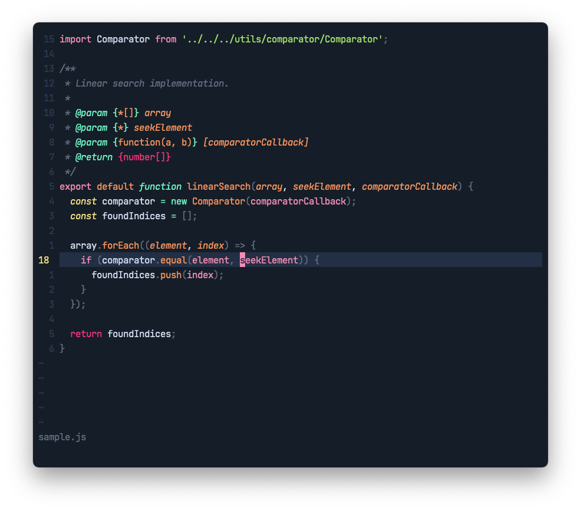

⚠️  Work in progresss

# BLOOP Theme for Vim

High contrast theme with a minimal, modern color palette.

- dark theme
- true colors support
- 256 colors support
- includes colors for lightline and fzf
